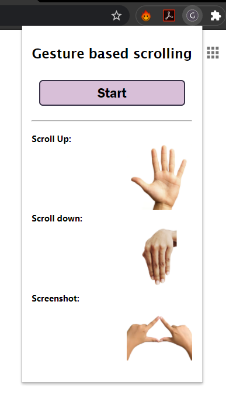

# G-scroll
> Chrome extension to enable scrolling webpages and taking screenshots with simple hand gestures.

## How to use:
1) clone the repository
2) Go to chrome://extensions and enable Developer Mode
3) Load unpacked extensions
4) Select the folder
5) Go to some webpage and click start in the extension

## Screenshots

## Author

- [Aravind Unnikrishnan](https://github.com/aravindmathradan)